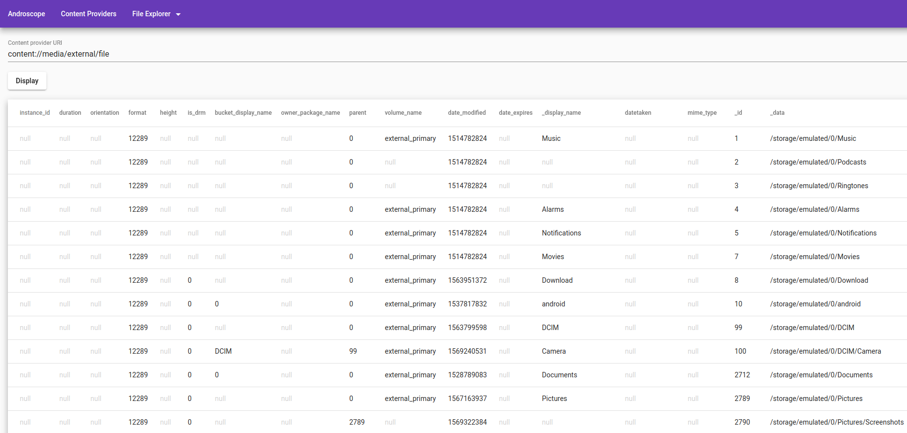
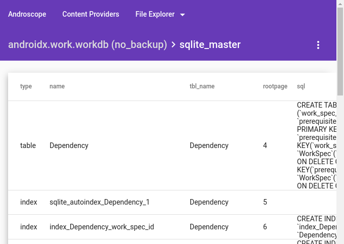

# Androscope

Androscope is a debug tool that allows you to look into internals of your Android application and device data. Some of this data is still not possible to see using standard debug tools, or it is not very convenient (you need to use ADB), or they require certain dependencies (like Chrome Developer Tools for Stetho). Androscope runs in any browser, even on the mobile device where your application is running.

[Features](#features)

[Setup](#setup)

[Recipes](#recipes)

- [Best practices](#best-practices)
- [Customize Androscope activity name](#customize-androscope-activity-name)
- [Auto-start Androscope](#auto-start-androscope)
- [Using Androscope in multiple applications](#using-androscope-in-multiple-applications)
- [Configure your database](#configure-your-database)
- [Configure image cache](#configure-image-cache)
- [View BLOB database data](#view-blob-database-data)

[Contribute](#contribute)

## Features
1. View file system of your application and other device folders.


2. View data from content providers that are accessible to your application. It includes of course all public system content providers, like Contacts or MediaStore, but they might require your application to ask for corresponding permissions.



3. View content of application databases, see SQL code of any database object or execute custom queries, also to modify your database structure or data.



4. Download and upload databases.

On top of that, Androscope is very efficient. Displayed data is cached and paginated, so you are not going to experience any freezes while viewing content. You can also adjust sorting in tables.

## Setup

Androscope supports Android applications with minimum API level 14.

Add Androscope dependency to your Gradle script:

```
debugImplementation "nl.ngti:androscope:1.0-alpha1"
```

No configuration in code is required.

<b>TODO: configure repository if it is going to be deployed to NGTI repository or not to Maven Central?</b>

It is a good idea to put Androscope only for debug build type or for a specific flavor, so you don't use it in production builds.

## Recipes

Androscope runs out of the box. But if you use Androscope regularly you might want to configure its activity name or in certain cases you might need to configure your custom database or adjust the port Androscope is running at, or make its web server start automatically with the application.

You might need to add additional configuration to the manifest of your application or customize string resources.

### Best practices

It is a good idea to do these customizations in a build type or a flavor to which Androscope dependency is added, so you don't mess up your production manifest. You can do this by adding manifest or string resource file into a custom [source set](https://developer.android.com/studio/build#sourcesets).

### Customize Androscope activity name
Customize a string resource `androscope_activity_label`:

```xml
<?xml version="1.0" encoding="utf-8"?>
<resources>
    <string name="androscope_activity_label" translatable="false">MyApp Androscope</string>
</resources>
```

### Auto-start Androscope
By default you need to open Androscope activity in order to start it. If you want Androscope to start automatically every time you run the application, add the following configuration into the manifest:

```xml
<?xml version="1.0" encoding="utf-8"?>
<manifest xmlns:android="http://schemas.android.com/apk/res/android">

    <application>
        <meta-data
            android:name="nl.ngti.androscope.AUTO_START"
            android:value="true" />
    </application>
</manifest>
```

### Using Androscope in multiple applications
You might have multiple projects using Androscope running at the same time on the same device. In this case you will need to set a custom port for each of them.

```xml
<?xml version="1.0" encoding="utf-8"?>
<manifest xmlns:android="http://schemas.android.com/apk/res/android">

    <application>
        <meta-data
            android:name="nl.ngti.androscope.HTTP_PORT"
            android:value="8791" />
    </application>
</manifest>
```

### Configure your database
In Androscope you can see all databases returned by [Context.databaseList()](https://developer.android.com/reference/android/content/Context#databaseList()) method. However, you might have databases in `no_backup` folder to avoid that they will be automatically backed up by Android. In this case to see your database in Androscope you will need to add a custom manifest configuration:

```xml
<?xml version="1.0" encoding="utf-8"?>
<manifest xmlns:android="http://schemas.android.com/apk/res/android">

    <application>
        <meta-data
            android:name="nl.ngti.androscope.DATABASE_NAME"
            android:value="no_backup://my_database.db" />
    </application>
</manifest>
```

**Note:** `no_backup` folders are supported since API 21 (Lollipop).

This feature is also convenient if you want to make your database be displayed always on top of the list. If it is located in the standard database location, you need to specify just the database name:

```xml
<meta-data
    android:name="nl.ngti.androscope.DATABASE_NAME"
    android:value="my_database.db" />
```

### Configure image cache
Androscope is able to detect by default default cache locations of [Picasso](https://square.github.io/picasso/), [Glide](https://github.com/bumptech/glide) and [Coil](https://github.com/coil-kt/coil) image libraries. If you use another image library or a custom location for your image cache - you need to tell Androscope where it is located and how can it filter only images out:

```xml
<?xml version="1.0" encoding="utf-8"?>
<manifest xmlns:android="http://schemas.android.com/apk/res/android">

    <application>
        <meta-data
            android:name="nl.ngti.androscope.IMAGE_CACHE"
            android:value="image_manager_disk_cache" />
        <meta-data
            android:name="nl.ngti.androscope.IMAGE_CACHE.filter"
            android:value="^.*\\.0$" />
    </application>
</manifest>
```

- `nl.ngti.androscope.IMAGE_CACHE` option configures the folder where the cache is located. It must be located in the application `cache` folder.

- `nl.ngti.androscope.IMAGE_CACHE.filter` is a regular expression for filenames inside the image cache folder. It should be able to filter only image files.


### View BLOB database data
[BLOB](https://www.sqlite.org/datatype3.html) values are not displayed by Androscope, because the data contained in blob might be too large or might be binary - only database creator knows that. If you still want to view your BLOB data in Androscope, you can see it using **Custom query** feature:

```sql
SELECT 
    CAST(my_blob_column AS TEXT)
FROM my_table_containing_blobs
```

## Contribute
***TODO***
